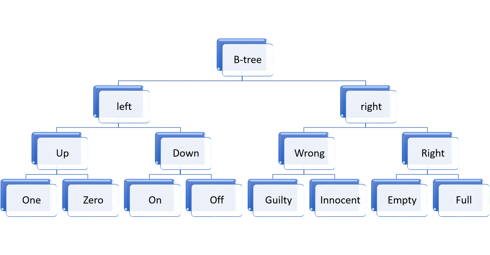
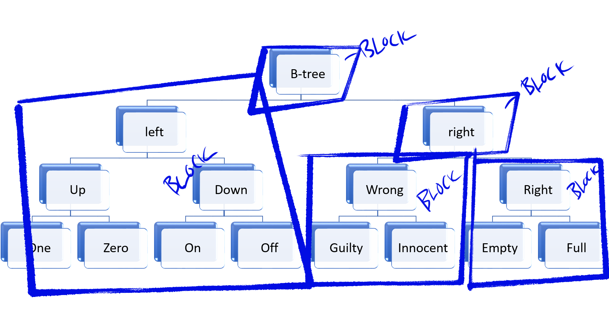
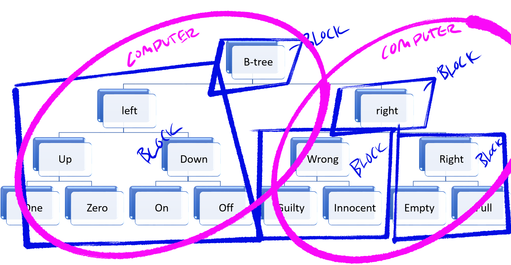

::: slide
Decentralized Data Structures 

It's not boring, I promise 🤓
:::

::: slide
When you build applications, what do you do with the data? 🤔
:::

::: slide
Why?

🧐
:::

::: slide
What if your data had a URL?

🤩
:::

::: slide
What if anyone in the world could serve that URL? 

🥳
:::

::: slide
```javascript
const cbor = require('dag-cbor-sync')()

let block = await cbor.mkblock({ title: "Mikeal's Feed" })
/*
Block Format
+-----+--------------------------------+
| CID | Data                           |
+-----+--------------------------------+
*/
block.cid  // CID - Content Identifier
block.data // Data - Buffer of encoded data 
```
:::

::: slide
Hashes are cool 😎
:::

::: slide
```javascript
const cbor = require('dag-cbor-sync')()
let block = await cbor.mkblock({ title: "Mikeal's Feed" })
/*
CID Format
+------------------------------+
| Codec (cbor|json)            |
+------------------------------+
|           +------------------+
| Multihash | Algorith | Hash  |
|           +------------------+
+------------------------------+
*/
// Add to key/value storage
await storage.put(block.cid.toBaseEncodedString(), block.data)
await publish(block.cid)
```
:::

::: slide
We just turned hashes into URLs 🤯
:::

::: slide
```javascript
const getNode = async cid => {
  let running = new Set()
  let url = `https://my-s3-bucket.aws.com/blocks/${cid}` 
  let promises = [
    fetch(url).then(resp => resp.arrayBuffer()),
    localDatabase.get(cid),
    dht.resolve(cid).then(client => client.get(cid))
  ]
  let fails = 0
  while (fails < running.length) {
    try {
      return cbor.decode(await Promise.race(promises))
    } catch (e) {
      fails += 1
    }
  }
}
```
:::

::: slide
How do I update the data?
:::

::: slide
```javascript
/* Let's create some new data */
let post = await cbor.mkblock({ title: 'First post!', ts: Date.now() })
await storage.put(post.cid.toBaseEncodedString(), post.data)

/* Let's get the prior data */
let feed = await get(cid)

/* Let's add the new data to the old data */
feed.posts = { 2019: [ post.cid ] }
let newRoot = await cbor.mkblock(feed)
await storage.put(newRoot.cid.toBaseEncodedString(), newRoot.data)

/* Let's publish the new state of the data */
await publish(newRoot.cid)
```
:::

::: slide

That's why we call it "linked" data ;)

:::

::: slide
```javascript
let _cid = newRoot.cid.toBaseEncodedString()
let post = await ipld.resolve(`${_cid}/2019/0`)
```
:::

::: slide
* We can take *any* amount of data and refer to it by a smallish string identifier.
* Anyone can host that data **anywhere**.
* We can create new data that refers to any other data, even parts of that data.
* We can do all of this in the browser, w/o a backend, w/o a "database."
:::

::: slide
Another word for link is "pointer" 😱
:::

::: slide

:::

::: slide

:::

::: slide

:::

::: slide
* ~~Data Mirroring~~
* ~~Data Export~~
* ~~Data Migration~~
* ~~Federation :(~~
:::

::: slide
https://github.com/ipld

Come drink this koolaid
🤑
